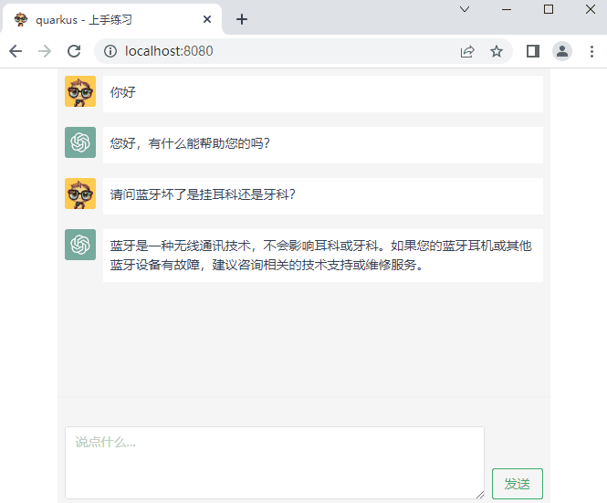
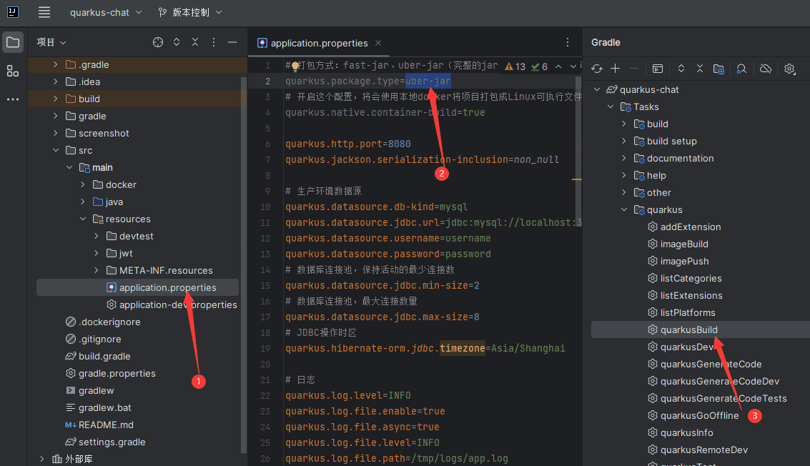

# Quarkus example

> Quarkus 版本：3.0.1.Final

## 项目介绍

使用 [Quarkus][Quarkus] 构建的 ChatGPT 聊天项目，用于上手练习 Quarkus ，本示例项目将包含：

- [Quarkus-Code](https://code.quarkus.io) 基础工程的搭建
- 使用 [quarkus-smallrye-jwt](https://quarkus.io/guides/security-jwt) 实现 JWT 的 Token 签发、身份认证
- 使用 [quarkus-hibernate-orm-panache](https://quarkus.io/guides/hibernate-orm-panache) 实现对关系型数据库的操作，本项目中支持 `MySQL` 和 `H2`
- 使用 [quarkus-hibernate-validator](https://quarkus.io/guides/validation) 对接口请求参数进行校验
- 使用 [quarkus-rest-client-reactive](https://quarkus.io/guides/rest-client-reactive) 调用外部 REST API，本项目中用于调用 OpenAI 的聊天接口
- 使用 Graalvm 构建原生可执行文件

> 提示: 开发模式默认使用的H2数据库，以内存模式运行，所以调试时无需搭建数据库环境

**运行示例截图：**



## 环境要求

- Gradle：7+
- JDK：17
- Docker：用于进行 native 打包，这不是必须的，除非你要构建本地可执行文件

## 编译项目

### 编译完整的 Jar

编译出的文件位置：`build/example-simple-quarkus-chat-1.0.0-SNAPSHOT-runner.jar`  
可通过 `java -jar` 执行 `example-simple-quarkus-chat-1.0.0-SNAPSHOT-runner.jar`

#### 命令行编译

```shell script
./gradlew build -Dquarkus.package.type=uber-jar
```

#### IDEA编译

1. 修改 `src/main/resources/application.properties` 中的参数 `quarkus.package.type=uber-jar`
2. 执行 `quarkus` 提供的脚本：`quarkusBuild`



### 编译 Fat jar

编译出的文件位置：`build/quarkus-app/`  
可通过 `java -jar` 执行 `quarkus-run.jar`

#### 命令行编译

```shell script
./gradlew build
```

#### IDEA编译

1. 修改 `src/main/resources/application.properties` 中的参数 `quarkus.package.type=fast-jar`
2. 执行 `quarkus` 提供的脚本：`quarkusBuild`

### 编译本地可执行文件

> 这将会在本地 Docker 中通过镜像自动构建，无需安装 GraalVM  
> 关于构建 native 的官方文档：[https://cn.quarkus.io/guides/building-native-image](https://cn.quarkus.io/guides/building-native-image)

编译出的文件位置：`build/example-simple-quarkus-chat-1.0.0-SNAPSHOT-runner`  
可直接运行 `example-simple-quarkus-chat-1.0.0-SNAPSHOT-runner`

#### 命令行编译

```shell script
./gradlew build -Dquarkus.package.type=native -Dquarkus.native.container-build=true
```

#### IDEA编译

1. 修改 `src/main/resources/application.properties` 中的参数 `quarkus.package.type=native` 和 `quarkus.native.container-build=true`
2. 执行 `quarkus` 提供的脚本：`quarkusBuild`

## 参考

- Quarkus 官网地址：https://quarkus.io
- Quarkus 项目地址：https://github.com/quarkusio

[Quarkus]: https://cn.quarkus.io
